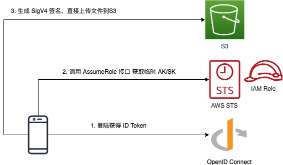
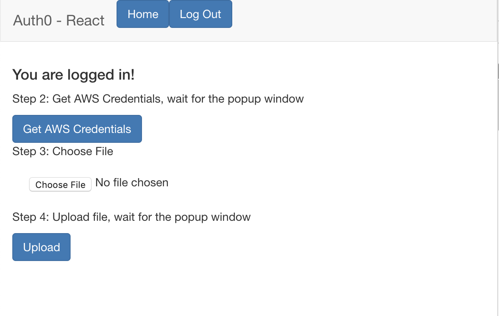
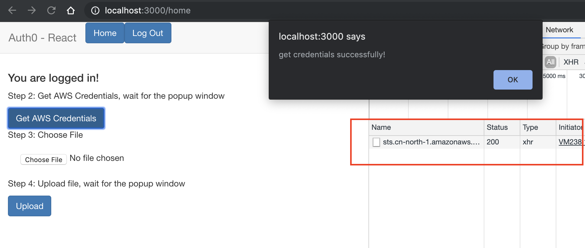
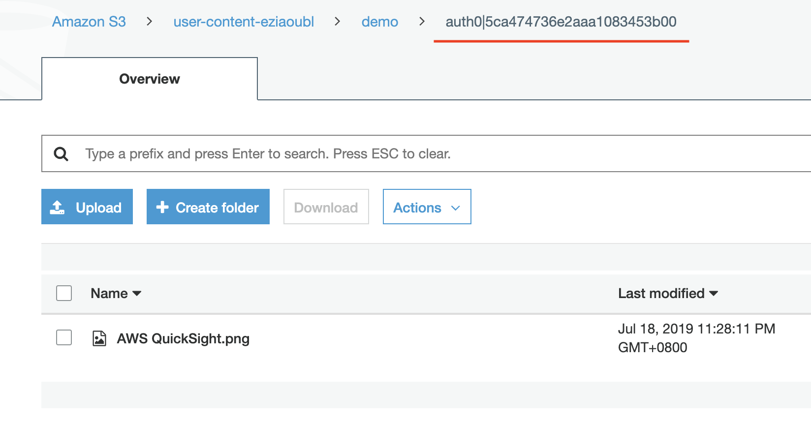
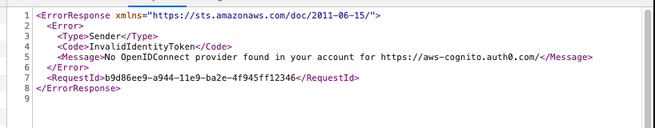
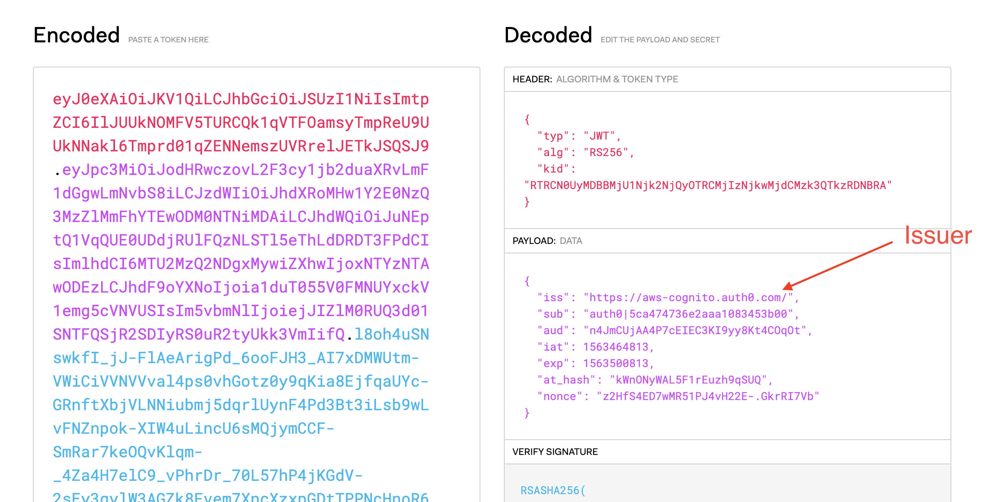

# STS, OpenID Connect 上传 S3 精细化权限控制

本文介绍如何使用 AWS Security Token Service(STS) 和 OpenID Connect 结合, 
实现用户只能上传和查看自己在 S3 中的文件。

S3 是一个对象存储服务，非常适合存储海量文件。它不仅支持从服务器端上传/下载 S3 中的内容，
同时允许客户从客户端直接上传/下载 S3 中的资源。

在实际应用过程中，我们经常遇到这样的需求：只允许用户 上传/下载/删除/修改(CRUD) 自己的文件。
本文将探讨利用 AWS STS, OpenID Connect 实现精细化权限控制，限制用户只能访问自己的文件。


[Amazon S3](https://aws.amazon.com/s3/) 是一个对象存储服务，非常适合存储海量文件。
它不仅支持从服务器端上传/下载 S3 中的内容，同时允许客户从客户端直接上传/下载 S3 中的资源。

[AWS Security Token Service](https://docs.aws.amazon.com/STS/latest/APIReference/Welcome.html) 
允许用户通过 API 的方式申请访问 AWS 资源的临时的 AccessKeyID 和 SecretAccessKey. 该用户可以是 IAM User,
也可以是联合登陆的用户。

[OpenID Connect](https://openid.net/connect/) 是在基于 OAuth 2.0 协议的基础上提供通过 API 
进行身份交互的规范。

## 前提

1. 本文将使用 [Auth0](https://auth0.com) 作为用户库。请注册 Auth0 账户，并按照
[文档](https://auth0.com/docs/dashboard/guides/applications/register-app-spa)添加 **application**。 
这并不要求用户一定使用 Auth0, 只要是支持 [OpenID Connect](https://openid.net/connect/) 标准的用户库都
可以使用次方法。

2. 本文架构部署使用 [**terraform**](https://www.terraform.io/) 一键部署AWS 资源，
请在本机安装 terraform, 并配置好[AWS Credentials](https://docs.aws.amazon.com/cli/latest/userguide/cli-configure-files.html)

3. Demo 包含前端 Web 应用，使用 yarn 做依赖管理，请自行安装 [**yarn**](https://yarnpkg.com/en/)

4. 需要了解 OpenID Connect 的基本机制，包括 **Access Token**, **ID Token**.

5. 需要了解 IAM Role. IAM 角色 是可在账户中创建的一种具有特定权限的 IAM 身份。
IAM 角色类似于 IAM 用户，因为它是一个 AWS 身份，该身份具有确定其在 AWS 中可执行和不可执行的操作的权限策略。

6. 本文使用 AWS China Region, 如使用 AWS Global Region, 请参考
[AWS区域与终端节点](https://docs.aws.amazon.com/zh_cn/general/latest/gr/rande.html)修改 endpoint。


## 架构和原理




步骤0：客户端检测到用户未登陆，跳转到登陆授权页面。以下是跳转链接：

```http request
https://aws-cognito.auth0.com/authorize?client_id=n4JmCUjAA4P7cEIEC3KI9yy8Kt4COqOt
&response_type=token%20id_token
&redirect_uri=http%3A%2F%2Flocalhost%3A3000%2Fcallback
&scope=openid
&state=VkFD4yrt9C2S2_qd67Xs8MHcBhxh2li0
&nonce=xXaQ-2sQnBCwMbGc1y7e3r0KgbC5~3sO
&auth0Client=eyJuYW1lIjoiYXV0aDAuanMiLCJ2ZXJzaW9uIjoiOS4xMC4xIn0%3D
```

上述 HTTP request 中的 auth0Client 为 Auth0 增加的字段，非 OIDC 标准字段


步骤1: 客户端向 OpenID Connect Provider(OIDC) 发起登录请求，登陆成功后，跳转回步骤1中的 
**redirect_uri**，并且在 HTTP URL 中包含 **access token** 和 **ID Token**。如下：

```http request
http://localhost:3000/callback#access_token=<access_token>
&expires_in=7200
&token_type=Bearer
& state=vaXfc.jDtU5sr37K75QRw.~ZI4E5uLDA
&id_token=<id_token>
```

服务器在授权成功后返回信息如上。其中包含 **id_token**.

步骤2. 调用 STS 的 `AssumeRole` API，获取临时 AK/SK

```shell
POST https://sts.cn-north-1.amazonaws.com.cn/
?Version=2011-06-15
&Action=AssumeRoleWithWebIdentity
&RoleArn=arn%3Aaws-cn%3Aiam%3A%3A057005827724%3Arole%2Foidc-role-eziaoubl
&RoleSessionName=web-identity
&WebIdentityToken=<id_token>
```

在上述接口中 `WebIdentityToken` 是 步骤1 通过 OIDC 获得的 ID Token, `RoleArn` 指向
预先创建好的 IAM Role. 通过 `AssumeRole` 接口返回的 AK/SK 具有该 IAM Role 所具备的权限。


步骤3. 通过 AK/SK 完成 SigV4 签名，然后直接上传文件到S3. 通常情况下，我们使用 AWS SDK 完成签名
和上传工作。


在步骤2中使用的 IAM Role 的 Policy 配置如下：

该 Role 所具有的 Policy 配置如下, 将其中的 **<s3-bucket-name>**, **<app-name>**, 
**<identity-provider-name>** 替换为实际使用的值。


```json
{
    "Version": "2012-10-17",
    "Statement": [
        {
            "Sid": "ListYourObjects",
            "Effect": "Allow",
            "Action": "s3:ListBucket",
            "Resource": [
                "arn:aws-cn:s3:::<s3-bucket-name>"
            ],
            "Condition": {
                "StringLike": {
                    "s3:prefix": [
                        "<app-name>/${<identity-provider-name>:sub}"
                    ]
                }
            }
        },
        {
            "Sid": "ReadWriteDeleteYourObjects",
            "Effect": "Allow",
            "Action": [
                "s3:GetObject",
                "s3:PutObject",
                "s3:DeleteObject"
            ],
            "Resource": [
                "arn:aws-cn:s3:::<s3-bucket-name>/<app-name>/${<identity-provider-name>:sub}",
                "arn:aws-cn:s3:::<s3-bucket-name>/<app-name>/${<identity-provider-name>:sub}/*"
            ]
        }
    ]
}
```

**${<identity-provider-name>:sub}** 是一个变量，实际上是 OpenID Connect 中的 sub 字段，
通常情况下是 OIDC 中的 username 字段。

通过如上的 Policy 配置，我们可以限制用户只能上传/下载/删除自己的文件。


## Demo 快速部署

本文使用 [Terraform](https://www.terraform.io/) 作为自动化资源创建工具，Terraform IT 是
一款基础架构自动化编排工具，如尚未安装，请按照[文档](https://learn.hashicorp.com/terraform/getting-started/install)
下载并安装。

步骤 0: 注册 Auth0 帐号，并添加 Application. 详细步骤请查看 [Auth0 操作手册](https://auth0.com/docs/dashboard/guides/applications/register-app-spa)。
请注意，此处不强制使用 Auth0, 只要符合 OIDC 规范即可。记录下 Application 的 **Domain** 和 **Client ID**。
在 **Settings -> Allowed Callback URLs** 中输入 `http://localhost:3000/callback`

步骤 1: 登陆 AWS 控制台，在 [IAM Identity Provider](https://console.amazonaws.cn/iam/home#/providers) 
中点击 **Create Provider**,

步骤 2: 在 **Provider Type** 中选择 **OpenID Connect**; 在 **Provider URL** 中输入 
Auth0 的 **Domain** 字段(必须是https://开头); 在 **Audience** 中输入 Auth0 的 **clientID**

步骤 3: 在 **terraform/variables.tf** 中修改变量的值。参数说明请参考注释

步骤 4: 通过 Terraform 自动化部署 IAM Role, IAM Policy
```shell
cd terraform
terraform init
terraform apply
```

步骤 5: 将 terraform 的输出拷贝到 `src/config.json` 中，并保存配置文件

步骤 6: 在项目根目录下安装 Web 依赖, 并运行前端程序 
```shell
cd ..
yarn install
yarn start
```

## 运行 Demo

步骤1: 点击页面上的 **Log In**  按钮，跳转到 Auth0 的认证页面，输入用户名密码。
等待页面跳转回 Web App, 显示已经登陆，页面如下:



步骤2: 点击 **Get AWS Credentials** 按钮。等待弹出对话框



步骤3: 点击 **Choose file** 选择要上传的文件，此处只支持图片

步骤4: 点击 **Upload** 按钮，等待文件上传成功，并弹出对话框

步骤5: 查看 S3 Bucket, 发现 S3 中图片的 keyname 包含 **OpenID Connect Sub**



至此，实验成功。想知道客户端的实现方式可查看, `src` 文件夹下的前端代码。
demo 程序的主要逻辑代码在 [**src/Auth/Auth.js**](src/Auth/Auth.js) 和 [**src/Home/Home.js**](src/Home/Home.js)。


## 故障排除

### No OpenIDConnect Provider Found In Your Account

如果您遇到一下 `No OpenIDConnect Provider Found In Your Account` 错误，请检查你的 IAM Identity Provider
名称是否以 `/` 结果。



您可以通过 [jwt.io](https://jwt.io/) 来解码 **ID Token** 来确认是否需要 IAM Identity Provider 
的名称。 正确的名称是 `iss` 字段中 `https://` 往后的全部内容。




## 如何销毁资源

步骤1: 删除 S3 内的文件

步骤2: 在 `terraform` 目录下运行 `terraform destroy`

步骤3：在 [IAM Identity Provider](https://console.amazonaws.cn/iam/home#/providers) 
中删除之前创建的 **Identity Provider**


## 参考资料


[Auth0 配置](https://auth0.com/docs/integrations/integrating-auth0-amazon-cognito-mobile-apps)

[JS S3 上传示例代码](https://docs.aws.amazon.com/cognito/latest/developerguide/getting-credentials.html#getting-credentials-1.javascript
)
